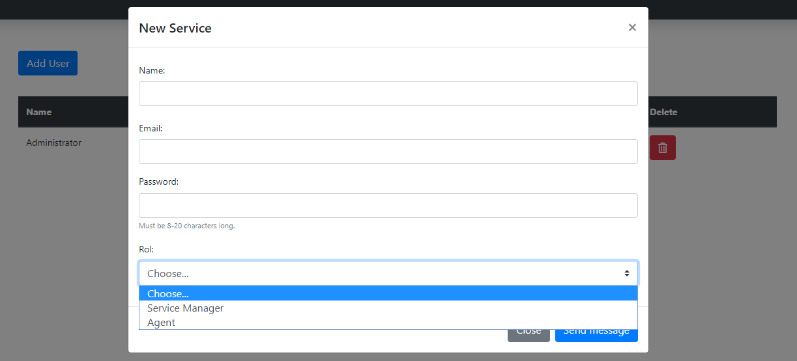

# DigitalQueue

Project developed by [Daniel Vela](https://github.com/develalopez), [Sergio Ruiz](https://github.com/Sergyo97) and [Willson Melo](https://github.com/swilsonmelo) for the course of Software
Architecture of the Colombian School of Engineering for the 2019-II semester.

## Problem to be solved

The current solutions for queing customers in businesses are limited in the aspects of customization and customer interactivity. The vendors of these kind of solutions offer systems that cannot be fully customized, depend on additional physical devices like a turn dispenser and can become stale or obsolete pretty quickly.

Usually, other solutions are focused in a particular business model, allowing little to no customization and thus reducing the number of potential clients. Additionally, these turns are based on *first come-first serve* model in which turns cannot be modified due to any possible circumstance (such as a client leaving the business before the correspondent attention is given), this causes dead time periods in which a service representative cannot attend anybody and clients lose their patience and leave, giving room for more similar incidents.

Additionally, these systems offer close to no feedback in terms of performance of the customer attention system.

## Description

The purpose of this project is to implement a digital turn system that is ready to configure and use in any kind of organization. This project should ease customer attention, remove/reduce dead time periods between clients, give full statistic reports in indicators of performance, customer satisfaction and possible bottlenecks or problematic areas, etc, all through a fully customizable, ready to use platform that can be easily adapted to any kind of business model.

The final aggregate value is based in the reports feature: a business can get immediate feedback in terms of performance, customer satisfaction and possible bottlenecks or problematic areas.

## User guide
Digital Queue will provide a friendly environment for easy handling by the organization as well as the user.

Once the software and login credentials are delivered for the first time, they can be accessed using the *Sign In* option.

The dashboard that the administrator has, contains all the options so that this person can manage the whole system from this account.

From this dashboard the administrator can keep track in *real time* of the shifts that are waiting to be attended by all the services, the completed ones and more options. 

In the same way, being an administrator, you can create, edit and delete services, attention points and system users.

When a user wants to close his session, just go to the *Sign out* button and click on it and your session will be closed.

Once an agent has been created, in the same way that the administrator can access the system, the system can do it, but you will find that your dashboard only consists of a tab that allows you to manage the turns that have been assigned to the attention point to which it belongs.

From here you can manage the shifts as you need, having the opportunity to call the next one, complete the one being attended or simply cancel it, all this in the company of notifications with each action.

Now, if it is a user who is making use of the software in function of consuming his main service, there is only one view for this one, where he can request a turn in the service that needs it.

## Architecture

Our solution is to deploy standalone Spring Boot applications compiled from a base code source (this repository) for each business to store their queues, users and configurations, with its own database and URL to access. Only employees can access the company's DigitalQueue deployment.

To begin, and for demonstration purposes, the application will be deployed to Heroku, where a PostgreSQL database will be available for the user to store data.

## Functionality Tests
### Create a new service and check its existence at the time of requesting a turn.

### Request an turn and verify its existence at the point of care that will handle it.

### Request two turns at the same time in the same service.

### Create new user in real-time.

### Verify security of access to endpoints without authentication.

## Quality Scenarios
#### All quality criteria are based on the following environment.
The criteria were tested with the following browsers:
 - Opera
 - Chrome
 - Firefox
 - Safari
 - The machine must meet these minimum requirements:
	 - Processor: Intel Core i3 1st generation.
	 - Ram: A ram memory greater than 4gb
	 - Graphics card: Minimum one integrated in the processor
	 - OS: Windows 7, Mac OSX 10.10, Linux kernel 4.1
	 - Internet Speed: 5Mbs

### Structure 
The following structure will be used to identify quality scenarios:

    1. Stimulus source: who or what generates the stimulus. 
    2. Stimulus: what you want to achieve.
    3. Environment: conditions within which the stimulus is presented.
    4. Artifact: part of the system that receives the stimulus.
    5. Answer: activity that occurs after the arrival of the stimulus.
    6. Response Measurement: criterion for testing the requirement.

### Latency Scenario
The system should be designed in such a way that even if the number of users is low at first, if in a short period of time they increase, its availability and performance will not be affected.

    1. Stimulus Source: System user, either registered or anonymous
    2. Stimulus: Navigate in the application
    3. Environment: Application with a normal traffic of maximum 100 users.
    4. Device: Backend Server (API Rest), database and FrontEnd
    5. Answer: There is no excessive delay in responding to requests.
    6. Response Measurement: low response time to requests for resources (less than 3000 ms), number of requests denied below 2.5%.
    
    1. Stimulus Source: System user, either registered or anonymous
    2. Stimulus: Navigate in the application
    3. Environment: Application with a normal traffic of maximum 100 users has a peak demand of 150 users surfing at a time.
    4 Device: Backend Server (API Rest), database
    5. Answer: There is no excessive delay in responding to requests.
    6. Response Measurement: low response time to requests for resources (less than 4000 ms), number of requests denied below 5%.

The system must provide real time services in an optimal way, responding fluently to the use by the public.

    1. Stimulus Source: Registered system users
    2. Stimulus: Use of functionalities in real time
    3. Environment: Normal traffic of maximum 5 users in a monitoring session, normal traffic in the application of maximum 100 users.
    4. Device: Frontend Server (Free Dyno in Heroku)
    5. Answer: The system behaves naturally and fluidly. 
    6. Response Measurement: Information transmitted in real time must be consistent. The actions of the other participants in the session are displayed in less than 5000 ms.

### Authentication Scenario
The system must allow interaction only to the pertinent users.

    1. Stimulus source: Malicious user
    2. Stimulus: Attempting to access to information or functions without authentication.
    3. Environment: Normal traffic of maximum 5 users in a monitoring session, normal traffic in the application of maximum 100 users.
    4. Artifact: Backend Server (API Rest), frontend application.
    5. Answer: The system rejects the interactions from the malicious user.
    6. Response Measurement: The confidentiality and intergrity of the information remains unharmed.

    1. Stimulus source: Malicious user
    2. Stimulus: Attempting to obtain credentials from the database.
    3. Environment: Normal traffic of maximum 5 users in a monitoring session, normal traffic in the application of maximum 100 users.
    4. Artifact: Database
    5. Answer: The credentials are properly encrypted and unreadable.
    6. Response Measurement: The confidentiality of the user credentials remains unharmed.
    
    1. Stimulus source: Registered user
    2. Stimulus: Attempting to access any page that requires authentication after logging out
    3. Environment: Normal traffic of maximum 5 users in a monitoring session, normal traffic in the application of maximum 100 users.
    4. Artifact: Database
    5. Answer: The website requires the user to authenticate again in order to get in.
    6. Response Measurement: The user gets no access to the website in any attempt.
    
    1. Stimulus source: Non-registered user
    2. Stimulus: Requesting a turn
    3. Environment: Normal traffic of maximum 5 users in a monitoring session, normal traffic in the application of maximum 100 users.
    4. Artifact: Frontend website
    5. Answer: The turn is correctly given to the user.
    6. Response Measurement: The user gets a new turn to be attended.

### Authorization Scenario
The services must require specific roles permissions to be used by the employees.

    1. Stimulus source: Registered administrator user.
    2. Stimulus: Accessing the attention point management site.
    3. Environment: Normal traffic of maximum 5 users in a monitoring session, normal traffic in the application of maximum 100 users.
    4. Artifact: Frontend.
    5. Answer: The site responds with 403 Unauthorized error.
    6. Response Measurement: The administrator has no access to the attention point management site.
    
    1. Stimulus source: Registered agent user.
    2. Stimulus: Accessing the dashboard or making requests to the API that he's not authorized to.
    3. Environment: Normal traffic of maximum 5 users in a monitoring session, normal traffic in the application of maximum 100 users.
    4. Artifact: Frontend, Backend (API Rest).
    5. Answer: The server responds with 403 Unauthorized to all the pertinent requests to the API or the web pages .
    6. Response Measurement: The agent has no access to the dashboard or the API.

### Adaptability Scenario
The website must be visible from any type of Internet browser covered by the **Bootstrap** framework that supports any device on the market.

    1. Stimulus source: Users equipment.
    2. Stimulus: Access to the page.
    3. Environment: Application in productive environment (deployment).
    4. Artifact: Front-end (Resource Navigator, Resource Management, RealTime Session).
    5. Answer: All content must be viewed from different browsers and computers.
    6. Response Measurement: Must be tested on different platforms.

### Availability Scenario
The system must provide high availability, the portal will be accessible **90%** of the time, on some occasions the service will be denied to the user, asking him to try to access later (fail with grace).

    1. Stimulus source: Interaction of users with the application. 
    2. Stimulus: Interaction of users on the page.
    3. Environment: Application being tested with a peak of users accessing various functionalities, up to 300 users.
    4. Artifact: Back-end Server.
    5. Answer: Resource requested or satisfactory error message (400).
    6. Response Measurement: The system does not show unplanned or unmanaged errors to the user, only 10% of requests are denied.

## Badges
 

## License
This project is under GNU General Public License - see  [LICENSE](https://github.com/404NotFoundECI/DigitalQueue/blob/master/LICENSE) to more info.

